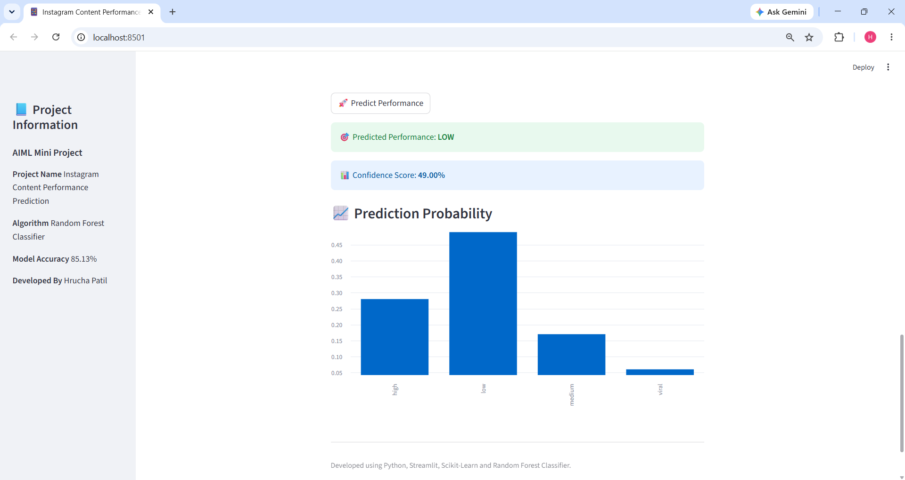

# Instagram Content Performance Predictor

## Project Overview
This project predicts the performance category of an Instagram post using a Machine Learning model, built during an AI/ML internship at Simdaa Technologies.

## Objective
To analyze Instagram post data and predict engagement performance using machine learning, classifying posts into four categories: **Low, Medium, High, Viral**.

## Algorithm Used
Random Forest Classifier (multi-class classification)

## Tech Stack
| Layer            | Technology                     |
|-------------------|---------------------------------|
| Language          | Python                          |
| Data Processing   | Pandas, NumPy                   |
| ML Model          | Scikit-learn (Random Forest)    |
| Visualization     | Matplotlib                      |
| Web App           | Streamlit                       |

## Dataset
Instagram Analytics Dataset

## Features Used
Account Type, Media Type, Content Category, Traffic Source, Follower Count, Likes, Comments, Shares, Saves, Reach, Impressions, Engagement Rate, Followers Gained, Caption Length, Hashtags Count

## Model Accuracy
**85.13%**

## How It Works
1. Raw Instagram post and engagement data is cleaned and preprocessed
2. Features are engineered from account, content, and engagement metadata
3. A Random Forest Classifier is trained to predict performance category
4. The trained model is deployed via a Streamlit web app for real-time predictions

## Installation
```bash
pip install -r requirements.txt
```

## How to Run
```bash
streamlit run app.py
```

## Output

The model predicts whether a post will perform as Low, Medium, High, or Viral based on the input features, with a confidence score shown alongside the prediction.

## Future Improvements
- Add support for video/reel-specific metrics
- Add explainability (e.g. SHAP values) to show which features drove a prediction
- Track prediction accuracy on real posted content over time

## Author
Hrucha Patil — [GitHub](https://github.com/PatilHrucha)
